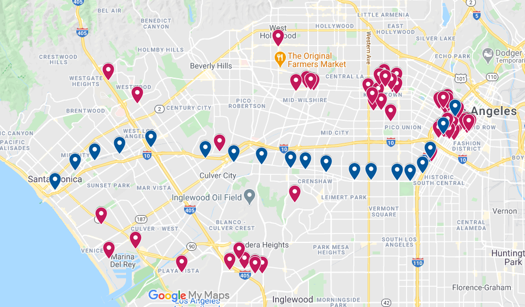

# apartment-map

Export apartments from apartments.com to import them into Google My Maps.

## Why?

So you can consider multiple factors beyond commute and  work is. Maybe you want to consider crime, air pollution, or even noise levels.

## Demo

I pulled apartments in Culver city along with the Metro stations:

## Instructions

1. Do your search on apartments.com. Make sure you are on page 1 of the results.
1. Right click on the page and hit "Inspect Element". In Chrome, this is just "Inspect".
    * Beware that this can change the size of the map and the results may change.
1. Go to the tab that says "Console".
1. Copy and paste apartments.js into the console. When it's done, the page will offer to save an `apartments.tsv` file. Download that.
1. Upload it to Google My Maps.
1. Pick address for the positioning column.
1. Pick name for the marker name column.